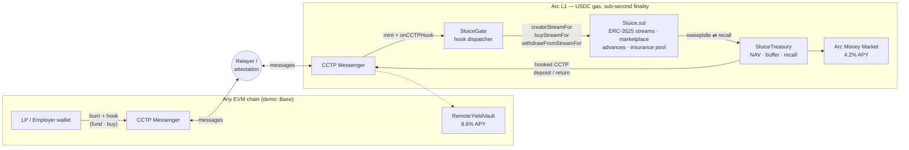

# Sluice

### Payroll that flows, block by block.

**Streaming USDC payroll and treasury infrastructure on [Arc](https://arc.network) -
salaries vest every second, taxes split themselves, income becomes a liquid asset,
and idle escrow earns yield across chains.**

*Built for the Programmable Money Hackathon · DeFi Track*


---

## Table of Contents

- [Why Sluice](#why-sluice)
- [Live Features](#live-features)
- [Architecture](#architecture)
- [How the Core Flows Work](#how-the-core-flows-work)
- [Quick Start - Local Demo](#quick-start--local-demo)
- [Testing](#testing)
- [Deploying to Arc Testnet](#deploying-to-arc-testnet)
- [Repository Layout](#repository-layout)
- [Technology Stack](#technology-stack)
- [Roadmap & Planned Integrations](#roadmap--planned-integrations)
- [Screenshots](#screenshots)
- [Security & Disclaimers](#security--disclaimers)

---

## Why Sluice

Payroll is the largest recurring money flow on earth, and it still runs like a
1970s batch job:

- Workers deliver value **every second** but are paid **every 30 days** - between
  pay runs they are effectively their employer's unsecured creditors.
- Tax withholding is manual back-office work, reconciled after the fact.
- Payroll escrow is one of the largest pools of **dead capital** in any company.
- Future income is real economic value that workers **cannot access, sell, or
  insure**.

Sluice rebuilds payroll as programmable money on Arc - Circle's L1 where **USDC is
the gas token** and finality is sub-second. An employer escrows salary once; from
that block onward the money *flows*.

## Live Features

Everything below is implemented, tested, and clickable in this repository today.

### Per-second salary streaming
Employers open a stream with an amount, duration, tax rate, and tax vault
(`createStream`). Salary vests continuously at a fixed USDC-per-second rate with
6-decimal precision; employees withdraw any vested amount at any time.

### Onchain tax & compliance splits
Every withdrawal automatically routes the configured basis points to a designated
tax vault **before** the employee is paid - compliance enforced by the contract,
not the back office. Configurable per stream (e.g. 8% payroll tax, 0% contractor).

### Streams are ERC-3525 semi-fungible tokens
Each stream is an SFT whose **token value equals the remaining streamable USDC**.
A vendored, minimal ERC-3525 implementation (`contracts/erc3525/`) supports:
- **Split** - carve part of a salary off to another address; deposit, rate, and
  vesting schedule carry over pro-rata with exact math.
- **Merge** - combine same-schedule, same-employer streams.
- **Transfer** - whole streams change owners; the new owner collects all future flow.

### P2P stream factoring marketplace
Employees list streams for sale at a discount (`listStreamForSale`); any liquidity
provider buys them (`buyStream`) - payment goes straight to the seller and the SFT
transfers atomically. Future income becomes instant liquidity, on standard rails.

### Self-repaying salary advances
`borrowSalaryAdvance` lets a stream owner draw up to **50% of unwithdrawn value**
immediately - zero interest, zero liquidation risk. The advance repays itself as
salary continues to vest.

### Credit-default insurance pool
Employees pay a one-time **0.5% premium** (`insureStream`) into a share-based pool
underwritten by USDC stakers (`stakeInsurancePool`). If the employer cancels a
stream early, the unvested shortfall is claimable from the pool
(`claimDefaultCoverage`). Stakers earn every premium.

### Stream-to-DeFi auto-triggers (Circle Swap Kit)
Per-wallet automation rules run after every withdrawal - e.g. *"swap 20% of each
paycheck to EURC."* Executed through `@circle-fin/swap-kit` with the connected
wallet; on chains the kit does not yet route, the trigger records a labeled
simulated run through the identical code path.

### Chain-abstracted payroll (CCTP burn-and-mint + hooks)
Arc settles; every other chain is an on/off ramp. Via `SluiceGate`:
- **Fund from any chain** - a single CCTP burn with a `FUND_STREAM` hook opens the
  stream on Arc; the employer keeps cancel rights.
- **Withdraw to any chain** — `withdrawToChain` pays tax on Arc and burns the net
  amount to the employee's chosen destination chain.
- **Buy a stream from any chain** - a burn with a `BUY_STREAM` hook settles the
  marketplace purchase atomically on mint; over-payments and vanished listings
  refund automatically.

The word "bridge" appears nowhere in the UI.

### Cross-chain auto-yield treasury
Idle escrow above a **40% liquidity buffer** sweeps into `SluiceTreasury`
(`sweepIdle`, permissionless), which rebalances across yield venues - a local Arc
money market and a remote vault reached via hooked CCTP transfer. Withdrawals that
outrun the buffer **auto-recall liquidity mid-transaction**; remote positions come
home with their accrued yield through a hooked CCTP return. Full NAV accounting and
an on-chain activity feed.

### Full product frontend
Next.js 16 App Router app: marketing landing, live dashboard with per-second
vesting animation, stream detail (withdraw / advance / insure / split / sell),
marketplace, treasury console, and automation rules - plus a zero-install **demo
wallet** for local evaluation.

## Architecture



| Contract | Purpose |
|---|---|
| [`Sluice.sol`](contracts/Sluice.sol) | Core payroll: ERC-3525 streams, vesting, tax splits, marketplace, advances, insurance pool, escrow-liability accounting |
| [`erc3525/ERC3525.sol`](contracts/erc3525/ERC3525.sol) | Vendored minimal ERC-3525 with value-transfer hook |
| [`crosschain/SluiceGate.sol`](contracts/crosschain/SluiceGate.sol) | CCTP hook receiver - cross-chain funding, buyouts, withdrawal exits |
| [`crosschain/SluiceTreasury.sol`](contracts/crosschain/SluiceTreasury.sol) | Idle-escrow yield router: sweep / rebalance / recall, NAV, adapter registry |
| [`crosschain/YieldAdapters.sol`](contracts/crosschain/YieldAdapters.sol) | Local money-market adapter + CCTP remote-vault adapter |
| [`crosschain/RemoteYieldVault.sol`](contracts/crosschain/RemoteYieldVault.sol) | Destination-chain vault; accrues APY, exits home with yield |
| [`crosschain/MockCCTPMessenger.sol`](contracts/crosschain/MockCCTPMessenger.sol) | Local stand-in mirroring CCTP v2 `depositForBurnWithHook` semantics |

> **Design note:** the mock messenger deliberately mirrors CCTP v2's burn/mint +
> hook interface, and [`web/scripts/relayer.mjs`](web/scripts/relayer.mjs) plays
> Circle's attestation service. Swapping to real CCTP domains through Circle's
> **Bridge Kit** is a configuration change, not a rewrite.

## How the Core Flows Work

**Stream lifecycle** - employer escrows `amount` USDC → SFT minted to employee with
value = amount → vests at `amount / duration` per second → withdrawals burn SFT
value, split tax, pay net → employer cancellation pays out vested, refunds
unvested (insured streams: the shortfall becomes a pool claim).

**Cross-chain fund** - employer burns USDC on chain B with an ABI-encoded
`(FUND_STREAM, employer, recipient, duration, taxBps, taxVault)` hook → relayer
delivers → messenger mints to `SluiceGate` and invokes `onCCTPHook` → gate opens
the stream with the minted funds, crediting the original employer.

**Treasury cycle** - anyone calls `sweepIdle()` (safe by construction: only
escrow above the 40% buffer moves) → `rebalance()` allocates 50/50 to the Arc
money market and, via hooked CCTP, the remote vault → any withdrawal exceeding
Sluice's local balance triggers `treasury.recall()` inside `_push` →
`requestRemoteReturn()` + relayer bring the remote position home **with yield**.

## Quick Start - Local Demo

Requirements: [Foundry](https://getfoundry.sh), Node 20+.

```bash
git clone --recurse-submodules https://github.com/mrnetwork0001/Sluice.git
cd Sluice && cd web && npm install && cd ..
./dev.sh
```

`dev.sh` boots the entire twin-chain environment:

1. Two anvil nodes - **Arc (local)** on `:8545` and **Base (local)** on `:8546`.
2. Seeded deployments on both sides: three salary streams (one insured, two listed
   at a discount), a 50,000 USDC insurance pool, and the cross-chain treasury.
3. The CCTP relayer (delivers burns, executes remote-vault returns).
4. The web app on `http://localhost:3000` (or next free port).

Open the app and click **Demo wallet** - it connects the seeded employee account
(anvil keeps dev accounts unlocked, so no browser extension is required). To play
the employer or LP roles, import anvil dev keys #0 / #2 into MetaMask.

**Where to see each feature**

| Feature | Where to click |
|---|---|
| Live vesting, withdraw, advance, insure, split, sell | Dashboard → any stream card |
| Withdraw to another chain | Stream detail → *"Pay out on Base — via CCTP"* |
| Fund a stream from another chain | Create Stream → *Fund from: Base via CCTP* |
| Buy a stream cross-chain | Marketplace → *"Buy from Base via CCTP ⚡"* |
| Treasury sweep / rebalance / recall + activity feed | Treasury tab |
| Swap Kit auto-triggers + history | Automation tab |

## Testing

```bash
forge test          # 26 tests
forge test -vvv     # verbose traces
```

Coverage spans per-second rate math (6-decimal precision), ERC-3525 value splits
and merges, marketplace validation, advance caps, insurance premiums/claims,
cancellation settlement, and the entire cross-chain stack - hooked funding,
cross-chain buyouts (including refund paths), withdrawal exits, treasury
sweep/rebalance/recall bounds, and remote yield returns. The test suite plays the
CCTP relayer itself, so cross-chain flows are exercised deterministically in one
EVM. CI (GitHub Actions) enforces `forge fmt`, the build, and the full suite on
every push.

## Deploying to Arc Testnet

| | |
|---|---|
| Chain ID | `5042002` (`0x4CEF52`) |
| RPC | `https://rpc.testnet.arc.network` |
| Explorer | `https://testnet.arcscan.app` |
| USDC (native gas) | `0x3600000000000000000000000000000000000000` |

```bash
export PRIVATE_KEY=0x...   # funded with Arc testnet USDC
forge script script/Deploy.s.sol --rpc-url arc_testnet --broadcast
```

Then set `NEXT_PUBLIC_SLUICE_ADDRESS` in `web/.env.local`. If contracts changed,
regenerate the typed ABI:

```bash
echo "export const sluiceAbi = $(forge inspect Sluice abi --json) as const;" > web/src/lib/sluiceAbi.ts
```

## Repository Layout

```
contracts/               Sluice.sol · vendored ERC-3525 · MockUSDC
contracts/crosschain/    MockCCTPMessenger · SluiceGate · SluiceTreasury
                         YieldAdapters · RemoteYieldVault
test/                    Sluice.t.sol · CrossChain.t.sol   (26 tests)
script/                  Deploy.s.sol (Arc testnet) · DeployLocal[B].s.sol (demo)
web/                     Next.js 16 app — wagmi v3 / viem / Tailwind v4
web/scripts/relayer.mjs  Local CCTP attestation relayer
web/src/lib/             chain configs · typed ABIs · deployment address JSONs
docs/                    screenshots · pitch deck · PITCH_DECK.md
dev.sh                   one-command twin-chain demo
```

## Technology Stack

| Layer | Technology |
|---|---|
| Settlement | **Arc L1** - USDC gas, sub-second finality |
| Contracts | Solidity 0.8.x, Foundry (via-IR), vendored ERC-3525 |
| Cross-chain | **CCTP v2 pattern** (burn/mint + hooks), local attestation relayer |
| Stablecoin tooling | **Circle Swap Kit** (auto-conversion), **App Kit**, **Bridge Kit** + `provider-cctp-v2` (installed, testnet-ready), **Unified Balance Kit** |
| Frontend | Next.js 16 (App Router), wagmi v3, viem, TanStack Query, Tailwind v4 |
| Quality | 26 Foundry tests, GitHub Actions CI (fmt + build + test), Playwright-driven E2E verification |

## Roadmap & Planned Integrations

**Phase 1 - Production rails** *(next)*
- [ ] **Arc testnet deployment** of the full contract suite (script ready)
- [ ] **Real CCTP v2 domains** via Circle **Bridge Kit** - replace the mock
      messenger with attested transfers across Arc, Base, Ethereum, and Arbitrum
- [ ] **Circle Gateway / Unified Balance Kit** on the dashboard - one balance view
      across every chain an employee touches
- [ ] Public deployment at **sluiceapp.xyz**

**Phase 2 - Payroll operations**
- [ ] Employer console: batch stream creation (CSV → payroll run), org-level
      treasury policies, role-based access
- [ ] **EURC salary legs** - multi-currency payroll with on-withdrawal FX via Swap Kit
- [ ] Scheduled top-ups and auto-renewing pay periods
- [ ] Streaming invoices for contractors (reverse direction)

**Phase 3 - Deeper DeFi**
- [ ] Real yield venues behind the adapter interface (Aave-class money markets,
      tokenized T-bill vaults) with risk-weighted allocation targets
- [ ] Secondary-market order book for streams (bids, auctions, partial fills)
- [ ] Under-collateralized credit scoring from on-chain income history
- [ ] Insurance-pool tranching (junior/senior risk)

**Phase 4 - Reach**
- [ ] Fiat off-ramp partners on withdrawal (salary → bank account)
- [ ] Account-abstraction wallets & gas sponsorship for employees
- [ ] Mobile-first PWA
- [ ] Compliance modules: jurisdiction-aware withholding templates, exportable
      tax-vault reports

## Screenshots

| | |
|---|---|
|  |  |
|  |  |

Full gallery in [`docs/screenshots/`](docs/screenshots). Pitch deck:
[`docs/Sluice_Checkpoint_Deck.pptx`](docs/Sluice_Checkpoint_Deck.pptx) ·
slide script in [`docs/PITCH_DECK.md`](docs/PITCH_DECK.md).

## Security & Disclaimers

This is **hackathon software** - unaudited, and not production-ready:

- `MockUSDC`, `MockCCTPMessenger`, the yield adapters, and `RemoteYieldVault` are
  local demo primitives (open mint/burn, permissionless relaying). Production uses
  native USDC and Circle's attested CCTP.
- `setGate` / `setTreasury` are one-time deploy wiring; a production system needs
  proper ownership, timelocks, and pausability.
- The treasury's liquidity buffer bounds sweeps, but adapter risk, remote-return
  latency, and insurance-pool solvency all deserve formal modeling before real
  funds are involved.

## License

MIT - see [`LICENSE`](LICENSE). Built with Foundry, Circle developer tooling, and
the Arc network.
