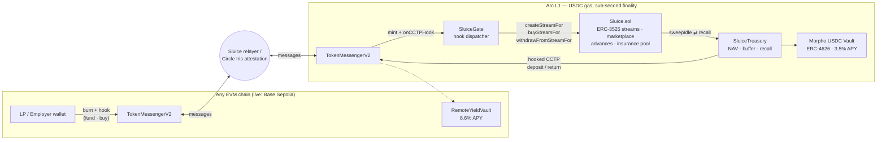

# Sluice

### Payroll that flows, block by block.

**Streaming USDC payroll and treasury infrastructure on [Arc](https://arc.network) -
salaries vest every second, taxes split themselves, income becomes a liquid asset,
and idle escrow earns yield across chains.**

*Built for the Programmable Money Hackathon · DeFi Track*


---

## Table of Contents

- [Why Sluice](#why-sluice)
- [Live Features](#live-features)
- [Architecture](#architecture)
- [How the Core Flows Work](#how-the-core-flows-work)
- [Quick Start - Local Demo](#quick-start--local-demo)
- [Testing](#testing)
- [Live on Arc Testnet](#live-on-arc-testnet)
- [Repository Layout](#repository-layout)
- [Technology Stack](#technology-stack)
- [Roadmap & Planned Integrations](#roadmap--planned-integrations)
- [Screenshots](#screenshots)
- [Security & Disclaimers](#security--disclaimers)

---

## Why Sluice

Payroll is the largest recurring money flow on earth, and it still runs like a
1970s batch job:

- Workers deliver value **every second** but are paid **every 30 days** - between
  pay runs they are effectively their employer's unsecured creditors.
- Tax withholding is manual back-office work, reconciled after the fact.
- Payroll escrow is one of the largest pools of **dead capital** in any company.
- Future income is real economic value that workers **cannot access, sell, or
  insure**.

Sluice rebuilds payroll as programmable money on Arc - Circle's L1 where **USDC is
the gas token** and finality is sub-second. An employer escrows salary once; from
that block onward the money *flows*.

## Live Features

Everything below is implemented, tested, and clickable in this repository today.

### Per-second salary streaming
Employers open a stream with an amount, duration, tax rate, and tax vault
(`createStream`). Salary vests continuously at a fixed USDC-per-second rate with
6-decimal precision; employees withdraw any vested amount at any time.

### Onchain tax & compliance splits
Every withdrawal automatically routes the configured basis points to a designated
tax vault **before** the employee is paid - compliance enforced by the contract,
not the back office. Configurable per stream (e.g. 8% payroll tax, 0% contractor).

### Streams are ERC-3525 semi-fungible tokens
Each stream is an SFT whose **token value equals the remaining streamable USDC**.
A vendored, minimal ERC-3525 implementation (`contracts/erc3525/`) supports:
- **Split** - carve part of a salary off to another address; deposit, rate, and
  vesting schedule carry over pro-rata with exact math.
- **Merge** - combine same-schedule, same-employer streams.
- **Transfer** - whole streams change owners; the new owner collects all future flow.

### P2P stream factoring marketplace
Employees list streams for sale at a discount (`listStreamForSale`); any liquidity
provider buys them (`buyStream`) - payment goes straight to the seller and the SFT
transfers atomically. Future income becomes instant liquidity, on standard rails.

### Self-repaying salary advances
`borrowSalaryAdvance` lets a stream owner draw up to **50% of unwithdrawn value**
immediately - zero interest, zero liquidation risk. The advance repays itself as
salary continues to vest.

### Credit-default insurance pool
Employees pay a one-time **0.5% premium** (`insureStream`) into a share-based pool
underwritten by USDC stakers (`stakeInsurancePool`). If the employer cancels a
stream early, the unvested shortfall is claimable from the pool
(`claimDefaultCoverage`). Stakers earn every premium.

### Stream-to-DeFi auto-triggers (Circle Swap Kit)
Per-wallet automation rules run after every withdrawal - e.g. *"swap 20% of each
paycheck to EURC."* Executed through `@circle-fin/swap-kit` with the connected
wallet; on chains the kit does not yet route, the trigger records a labeled
simulated run through the identical code path.

### Chain-abstracted payroll (CCTP burn-and-mint + hooks)
Arc settles; every other chain is an on/off ramp. Via `SluiceGate`:
- **Fund from any chain** - a single CCTP burn with a `FUND_STREAM` hook opens the
  stream on Arc; the employer keeps cancel rights.
- **Withdraw to any chain** - `withdrawToChain` pays tax on Arc and burns the net
  amount to the employee's chosen destination chain.
- **Buy a stream from any chain** - a burn with a `BUY_STREAM` hook settles the
  marketplace purchase atomically on mint; over-payments and vanished listings
  refund automatically.

The word "bridge" appears nowhere in the UI.

### Cross-chain auto-yield treasury
Idle escrow above a **40% liquidity buffer** sweeps into `SluiceTreasury`
(`sweepIdle`, permissionless), which rebalances across yield venues - a local Arc
money market and a remote vault reached via hooked CCTP transfer. Withdrawals that
outrun the buffer **auto-recall liquidity mid-transaction**; remote positions come
home with their accrued yield through a hooked CCTP return. Full NAV accounting and
an on-chain activity feed.

### Full product frontend
Next.js 16 App Router app: marketing landing, live dashboard with per-second
vesting animation, stream detail (withdraw / advance / insure / split / sell),
marketplace, treasury console, and automation rules - all wired to the live Arc
Testnet deployment.

## Architecture



| Contract | Purpose |
|---|---|
| [`Sluice.sol`](contracts/Sluice.sol) | Core payroll: ERC-3525 streams, vesting, tax splits, marketplace, advances, insurance pool, escrow-liability accounting |
| [`erc3525/ERC3525.sol`](contracts/erc3525/ERC3525.sol) | Vendored minimal ERC-3525 with value-transfer hook |
| [`crosschain/SluiceGate.sol`](contracts/crosschain/SluiceGate.sol) | CCTP hook receiver - cross-chain funding, buyouts, withdrawal exits |
| [`crosschain/SluiceTreasury.sol`](contracts/crosschain/SluiceTreasury.sol) | Idle-escrow yield router: sweep / rebalance / recall, NAV, adapter registry |
| [`crosschain/ERC4626Adapter.sol`](contracts/crosschain/ERC4626Adapter.sol) | Real ERC-4626 adapter — deposits idle escrow into the Morpho USDC vault on Arc |
| [`crosschain/YieldAdapters.sol`](contracts/crosschain/YieldAdapters.sol) | Reserve adapter (simulated APY, used in tests) + CCTP remote-vault adapter |
| [`crosschain/RemoteYieldVault.sol`](contracts/crosschain/RemoteYieldVault.sol) | Destination-chain vault; accrues APY, exits home with yield |
| [`crosschain/CCTPInterfaces.sol`](contracts/crosschain/CCTPInterfaces.sol) | Canonical `TokenMessengerV2` / `MessageTransmitterV2` interfaces |

> **No mock messenger.** Cross-chain transfers go through Circle's canonical
> `TokenMessengerV2` and are attested by Circle's Iris API; the local
> [`web/scripts/cctp-relayer.mjs`](web/scripts/cctp-relayer.mjs) only *delivers*
> attested messages and invokes their hooks — it does not stand in for CCTP.
> Circle's **Bridge Kit** is deliberately not used: it does not express the
> `depositForBurnWithHook` payloads Sluice's gate depends on.

## How the Core Flows Work

**Stream lifecycle** - employer escrows `amount` USDC → SFT minted to employee with
value = amount → vests at `amount / duration` per second → withdrawals burn SFT
value, split tax, pay net → employer cancellation pays out vested, refunds
unvested (insured streams: the shortfall becomes a pool claim).

**Cross-chain fund** - employer burns USDC on chain B with an ABI-encoded
`(FUND_STREAM, employer, recipient, duration, taxBps, taxVault)` hook → relayer
delivers → messenger mints to `SluiceGate` and invokes `onCCTPHook` → gate opens
the stream with the minted funds, crediting the original employer.

**Treasury cycle** - anyone calls `sweepIdle()` (safe by construction: only
escrow above the 40% buffer moves) → `rebalance()` allocates 50/50 to the Arc
money market and, via hooked CCTP, the remote vault → any withdrawal exceeding
Sluice's local balance triggers `treasury.recall()` inside `_push` →
`requestRemoteReturn()` + relayer bring the remote position home **with yield**.

## Quick Start

Requirements: Node 20+ and an injected wallet (MetaMask or similar).

```bash
git clone --recurse-submodules https://github.com/mrnetwork0001/Sluice.git
cd Sluice/web && npm install && npm run dev
```

Open `http://localhost:3000` and connect your wallet — the app offers to add
**Arc Testnet** (chain `5042002`) automatically. Fund it from the faucet linked in
the app; on Arc, USDC *is* the gas token, so one faucet claim covers both.

There is no local chain to boot and no seed data to generate: the app talks
directly to the live Arc Testnet deployment listed below.

Optional environment (only for the Circle-hosted features — see
[`web/.env.local.example`](web/.env.local.example)):

| Variable | Enables |
|---|---|
| `NEXT_PUBLIC_CIRCLE_APP_ID` | MPC wallet onboarding at `/onboard` |
| `CIRCLE_API_KEY` | server-side Circle Wallets + Swap Kit proxy |

**Cross-chain flows need the relayer.** Funding or exiting via Base Sepolia
requires the CCTP relayer to deliver attested messages and execute their hooks:

```bash
PRIVATE_KEY=0x... node web/scripts/cctp-relayer.mjs
```

Without it a burn is still attested by Circle, but nothing mints on the
destination chain — the stream will not appear.

**Where to see each feature**

| Feature | Where to click |
|---|---|
| Live vesting, withdraw, advance, insure, split, sell | Dashboard → any stream card |
| Withdraw to another chain | Stream detail → *"Pay out on Base — via CCTP"* |
| Fund a stream from another chain | Create Stream → *Fund from: Base via CCTP* |
| Buy a stream cross-chain | Marketplace → *"Buy from Base via CCTP ⚡"* |
| Treasury sweep / rebalance / recall + activity feed | Treasury tab |
| Swap Kit auto-triggers + history | Automation tab |
| Seedless employee wallet (Circle MPC) | `/onboard` |

## Testing

```bash
forge test          # 44 tests
forge test -vvv     # verbose traces
```

Coverage spans per-second rate math (6-decimal precision), ERC-3525 value splits
and merges, marketplace validation, advance caps, insurance premiums/claims,
cancellation settlement, and the entire cross-chain stack - hooked funding,
cross-chain buyouts (including refund paths), withdrawal exits, treasury
sweep/rebalance/recall bounds, and remote yield returns. The test suite plays the
CCTP relayer itself, so cross-chain flows are exercised deterministically in one
EVM. CI (GitHub Actions) enforces `forge fmt`, the build, and the full suite on
every push.

## Live on Arc Testnet

The core Sluice contract is **deployed, seeded, and streaming** on the real Arc
Testnet - per-second vesting, tax splits, marketplace, advances, and the
insurance pool all run against native USDC:

| | |
|---|---|
| **Sluice (core payroll)** | [`0xc0aD99f53A49DB154098717Dbdd0B16c73B2f32D`](https://testnet.arcscan.app/address/0xc0aD99f53A49DB154098717Dbdd0B16c73B2f32D) |
| **SluiceGate (CCTP entry/exit)** | [`0x4B5fB3206bf6B4c69D9081c7D35187A0E0cc55E8`](https://testnet.arcscan.app/address/0x4B5fB3206bf6B4c69D9081c7D35187A0E0cc55E8) |
| **SluiceTreasury (auto-yield)** | [`0x5d5fa6CD2FBde91B2F9045450F43065C4E9cD691`](https://testnet.arcscan.app/address/0x5d5fa6CD2FBde91B2F9045450F43065C4E9cD691) |
| **Morpho USDC Vault via Circle Earn (3.5%)** | [`0xB4968f2d5dCe632f46b006f19D004D7e4Bd9BCAb`](https://testnet.arcscan.app/address/0xB4968f2d5dCe632f46b006f19D004D7e4Bd9BCAb) |
| **CCTP Remote Adapter** | [`0x4D75134A5a34F034F913adCF3D7433fDf4345498`](https://testnet.arcscan.app/address/0x4D75134A5a34F034F913adCF3D7433fDf4345498) |
| **RemoteYieldVault (Base Sepolia, 8.6%)** | [`0xd8067404bd10D9bDf15BfD0D771696550d05Ecd1`](https://sepolia.basescan.org/address/0xd8067404bd10D9bDf15BfD0D771696550d05Ecd1) |
| Chain ID | `5042002` (`0x4CEF52`) |
| RPC | `https://rpc.testnet.arc.network` |
| Explorer | `https://testnet.arcscan.app` |
| USDC (native gas) | `0x3600000000000000000000000000000000000000` |

These are the addresses the app actually loads, from
[`web/src/lib/deployments.5042002.json`](web/src/lib/deployments.5042002.json)
and [`deployments.84532.json`](web/src/lib/deployments.84532.json).

**Auto-triggers are real swaps too.** Withdrawal rules route a slice of each
paycheck through Circle Swap Kit on Arc — live quotes come from Circle's routing
service and the conversion is an on-chain transaction
([example: 0.20 USDC → 0.15503 EURC](https://testnet.arcscan.app/tx/0xce142d92140cc758c0df8d170010628c50f9991045a7cb3bb9118abaa4de495f)).
EURC on Arc is `0x89B50855Aa3bE2F677cD6303Cec089B5F319D72a`. Because Swap Kit's
API blocks cross-origin browser calls, quote/route requests are forwarded by a
server-side proxy (`web/src/app/api/circle/[...path]/route.ts`) — the swap itself
is still signed and broadcast by the user's wallet.

**Cross-chain runs on real Circle CCTP v2 — nothing is mocked.** Burns go through
the canonical `TokenMessengerV2`
(`0x8FE6B999Dc680CcFDD5Bf7EB0974218be2542DAA`, Arc domain 26 ↔ Base Sepolia
domain 6), Circle's Iris API attests them, and the Sluice relayer
([`web/scripts/cctp-relayer.mjs`](web/scripts/cctp-relayer.mjs)) delivers each
mint via `MessageTransmitterV2.receiveMessage` and executes its hook. Yield is
paid in real USDC from pre-funded reserves. Verified end-to-end on the live
testnets: a 0.10 USDC withdrawal exited Arc and landed as **0.092 USDC on Base
Sepolia** (net of 8% tax); a 2.00 USDC burn on Base Sepolia opened a salary
stream on Arc through the gate hook; and the treasury swept escrow, split it
across both chains, and recalled the remote position home with its yield.

### Redeploying

```bash
export PRIVATE_KEY=0x...   # funded with Arc testnet USDC
forge script script/Deploy.s.sol --rpc-url arc_testnet --broadcast
```

> **Careful:** `script/Deploy.s.sol` rewrites
> `web/src/lib/deployments.5042002.json` with only the `sluice` key, dropping the
> `gate` / `treasury` / adapter / `fromBlock` entries and disabling every
> cross-chain feature. Re-run `script/DeployCrossChain.s.sol` and
> `script/AddEarnAdapter.s.sol` afterwards, or restore the other keys by hand.

If contracts changed, regenerate the typed ABI:

```bash
echo "export const sluiceAbi = $(forge inspect Sluice abi --json) as const;" > web/src/lib/sluiceAbi.ts
```

## Repository Layout

```
contracts/                    Sluice.sol · vendored ERC-3525
contracts/crosschain/         SluiceGate · SluiceTreasury · ERC4626Adapter
                              YieldAdapters · RemoteYieldVault · CCTPInterfaces
contracts/mocks/              MockUSDC · MockERC4626  (test fixtures only)
test/                         Sluice.t.sol · CrossChain.t.sol   (44 tests)
script/                       Deploy · DeployCrossChain · AddEarnAdapter
                              AddRemoteAdapter · DeployBaseVault
web/                          Next.js 16 app — wagmi v3 / viem / Tailwind v4
web/scripts/cctp-relayer.mjs  CCTP attestation delivery + hook execution
web/src/lib/                  chain configs · typed ABIs · deployment address JSONs
docs/                         screenshots · pitch deck · PITCH_DECK.md
```

## Technology Stack

| Layer | Technology |
|---|---|
| Settlement | **Arc L1** - USDC gas, sub-second finality |
| Contracts | Solidity 0.8.x, Foundry (via-IR), vendored ERC-3525 |
| Cross-chain | **Circle CCTP v2** — canonical `TokenMessengerV2` + hooks, Iris attestation, local delivery relayer |
| Stablecoin tooling | **Swap Kit** (real USDC→EURC auto-conversion), **Gateway / Unified Balance Kit** (unified cross-chain balance), **Circle Wallets** (MPC onboarding), Morpho USDC vault via ERC-4626 (the vault Circle Earn surfaces on Arc) |
| Frontend | Next.js 16 (App Router), wagmi v3, viem, TanStack Query, Tailwind v4 |
| Quality | 44 Foundry tests, GitHub Actions CI (fmt + build + test), manual end-to-end verification on live Arc + Base Sepolia |

## Roadmap & Planned Integrations

**Phase 1 - Production rails** — ✅ shipped
- [x] **Arc testnet deployment** of the full contract suite — live, addresses above
- [x] **Real CCTP v2** — canonical `TokenMessengerV2`, Circle Iris attestation,
      Arc domain 26 ↔ Base Sepolia domain 6. The mock messenger is gone.
- [x] **Circle Gateway / Unified Balance Kit** on the dashboard
- [x] **Circle Wallets** — seedless MPC onboarding for employees at `/onboard`
- [x] **Circle Earn** — idle escrow earns real yield in the Morpho USDC vault
- [ ] Public deployment at **sluiceapp.xyz**

**Phase 2 - Payroll operations** — partly shipped
- [x] Batch stream creation — paste a roster or drop a CSV, exact amounts or
      percentage splits, fundable from another chain
- [x] **EURC salary legs** — on-withdrawal FX via Swap Kit auto-triggers
- [x] Scheduled top-ups / recurring pay periods
- [ ] Org-level treasury policies and role-based access
- [ ] Streaming invoices for contractors (reverse direction)
- [ ] More CCTP domains — Ethereum, Arbitrum, Avalanche, Optimism
- [ ] Solana payouts via Gateway (`withdrawToDomain` is already Solana-ready)
- [ ] Hosted relayer so cross-chain flows need no local process

**Phase 3 - Deeper DeFi**
- [ ] Real yield venues behind the adapter interface (Aave-class money markets,
      tokenized T-bill vaults) with risk-weighted allocation targets
- [ ] Secondary-market order book for streams (bids, auctions, partial fills)
- [ ] Under-collateralized credit scoring from on-chain income history
- [ ] Insurance-pool tranching (junior/senior risk)

**Phase 4 - Reach**
- [ ] Fiat off-ramp partners on withdrawal (salary → bank account)
- [ ] Account-abstraction wallets & gas sponsorship for employees
- [ ] Mobile-first PWA
- [ ] Compliance modules: jurisdiction-aware withholding templates, exportable
      tax-vault reports

## Screenshots

| | |
|---|---|
|  |  |
|  |  |

Full gallery in [`docs/screenshots/`](docs/screenshots). Pitch deck:
[`docs/Sluice_Checkpoint_Deck.pptx`](docs/Sluice_Checkpoint_Deck.pptx) ·
slide script in [`docs/PITCH_DECK.md`](docs/PITCH_DECK.md).

## Security & Disclaimers

This is **hackathon software** - unaudited, and not production-ready:

- The live deployment uses **native Arc USDC and Circle's attested CCTP v2** —
  nothing on the critical path is mocked. `MockUSDC` and `MockERC4626` remain in
  `contracts/mocks/` purely as Foundry test fixtures and are not deployed.
- `RemoteYieldVault` and the `ReserveYieldAdapter` model yield from pre-funded
  reserves rather than a real venue; the Arc-side `ERC4626Adapter` is real.
- `setGate` / `setTreasury` are one-time, first-caller-wins wiring with **no
  ownership check**. The live instance is already wired, but any fresh deployment
  must be wired in the same transaction batch or an attacker can claim the gate —
  which is privileged (`withdrawFromStreamFor`). Production needs an owner,
  timelocks, and pausability.
- Insured cancellation refunds the unvested balance to the employer *and* records
  the same amount as a claimable shortfall, and nothing prevents `employer ==
  recipient`. A production build needs that guard plus a funded, underwritten pool.
- The relayer is permissionless by design (it only delivers Circle-attested
  messages) but it is a single local process — if it is not running, cross-chain
  transfers are attested and never minted.
- The treasury's liquidity buffer bounds sweeps, but adapter risk, remote-return
  latency, and insurance-pool solvency all deserve formal modeling before real
  funds are involved.

## License

MIT - see [`LICENSE`](LICENSE). Built with Foundry, Circle developer tooling, and
the Arc network.
